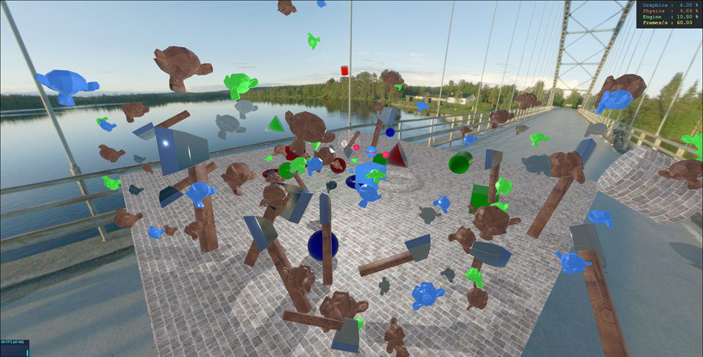

# INC492-Web3D-2022

## Run Application
- Open the `index.html`.
- Right-click and choose `Open with Live Server`.

> The `Live Server` can be installed from the `Extension`.

---

## Run Examples
- Open a `*.js` file in the `examples` directory.
- Copy content of the `*.js` file.
- Paste/Replace the copied content in the `main.js` and save.
- Open the `index.html` and run using `Live Server`.

---

## Note
The contents in this repository are continuously updated. Be sure you are using the latest update.

---

---

## Day1 (15 March 2022)
- Setup and run demo application.

---

## Day2 (22 March 2022)

- Engine operations (understand its code).
- Create and export model(s) using Blender.
- Import model(s) into application.

---

## Day3 (29 March 2022)
- > 5 Minutes Quiz (5-8 questions, 10 points).
- Object manipulation.
- Keyboard input.
- Using external (downloaded) models.

## Day4 (05 April 2022)
- > 5 Minutes Quiz (5-8 questions, 10 points).
- RayCast
- Material
- Child-Parent objects

## 12 April 2022 NO CLASS

